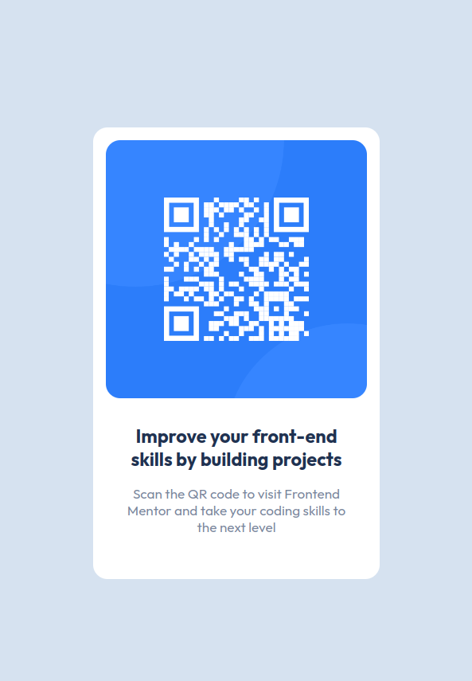

# Frontend Mentor - QR code component solution

This is a solution to the [QR code component challenge on Frontend Mentor](https://www.frontendmentor.io/challenges/qr-code-component-iux_sIO_H). Frontend Mentor challenges help you improve your coding skills by building realistic projects.

## Table of contents

- [Overview](#overview)
  - [Screenshot](#screenshot)
  - [Links](#links)
- [My process](#my-process)
  - [Built with](#built-with)
  - [What I learned](#what-i-learned)
- [Author](#author)

## Overview

This was my first project to the Frontend Mentor challenges. It was a good experience, because it felt like a real world workflow where you receive a design of a component that you have to implement.
For this challenge I used solely HTML and CSS. To create the component layout I used Flexbox, and to recreate the mobile design used media queries.

### Screenshot

### Links

- Solution URL: [Add solution URL here](https://github.com/Kurt3z/qr-code-component.git)
- Live Site URL: [Add live site URL here](https://kurt3z.github.io/qr-code-component)

## My process

### Built with

- Semantic HTML5 markup
- CSS custom properties
- Flexbox
- Media queries

### What I learned

I used this challenge to learn and apply Flexbox and layout skills, but the main takeway was the experience of a real scenario workflow, using Git and GitHub and recreating a design through code.

## Author

- Frontend Mentor - [@yourusername](https://www.frontendmentor.io/profile/Kurt3z)
